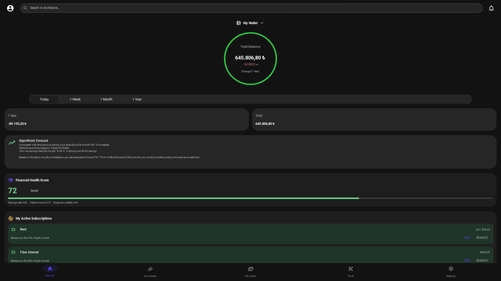
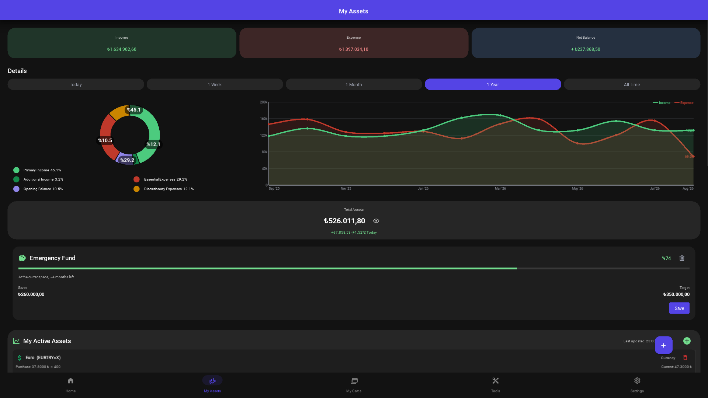
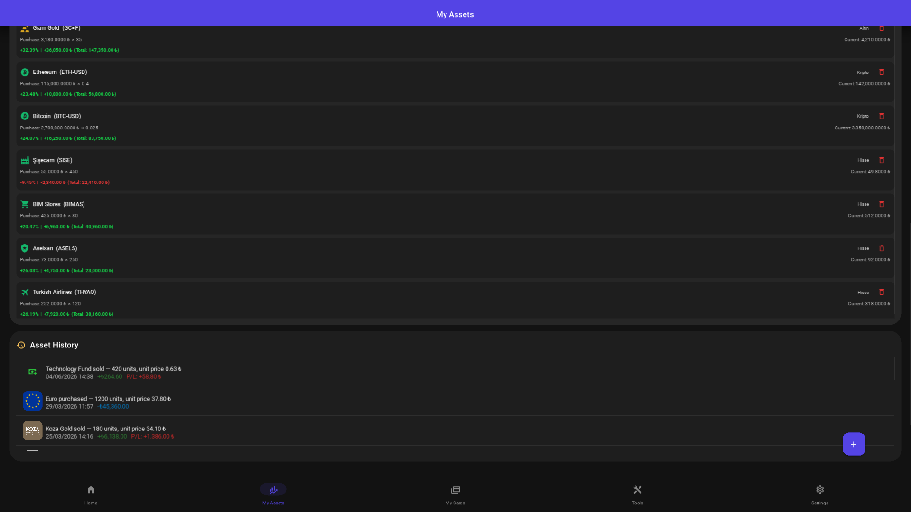
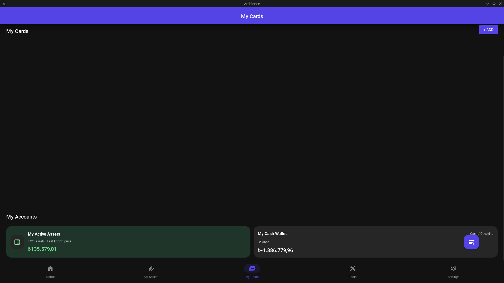
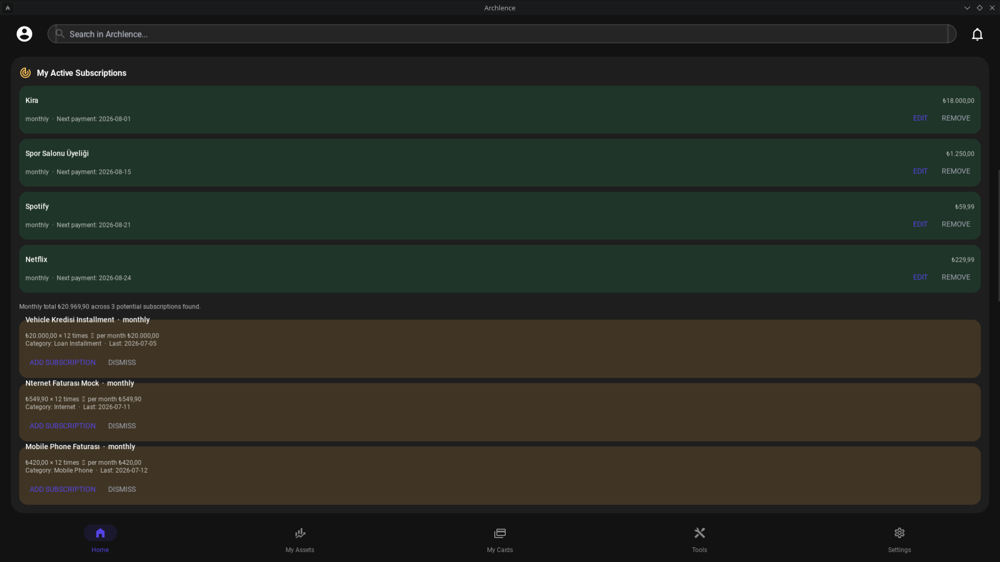
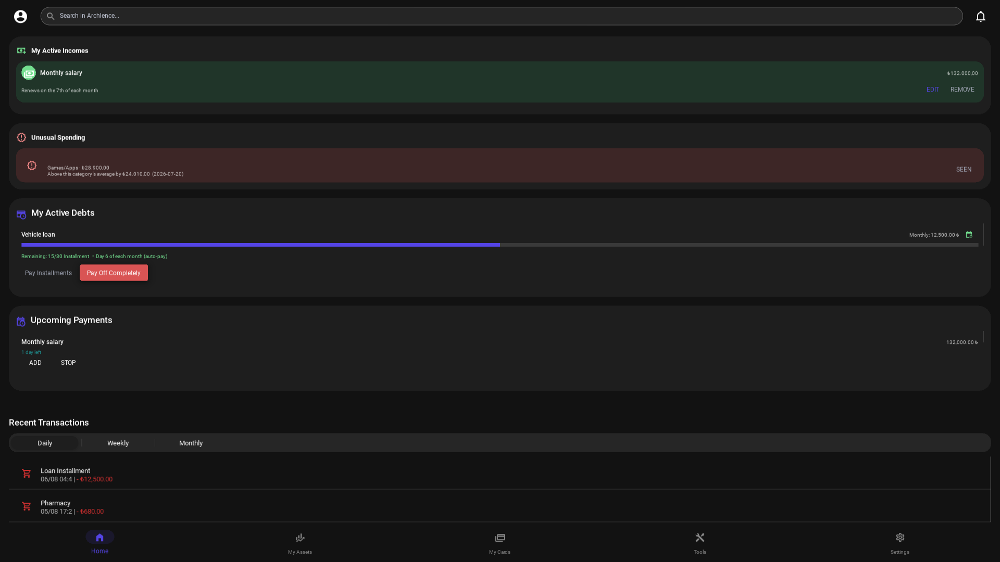
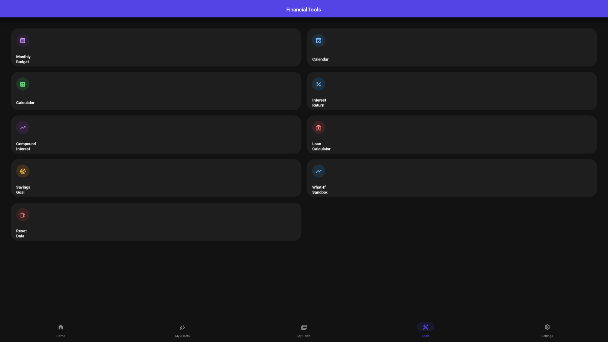
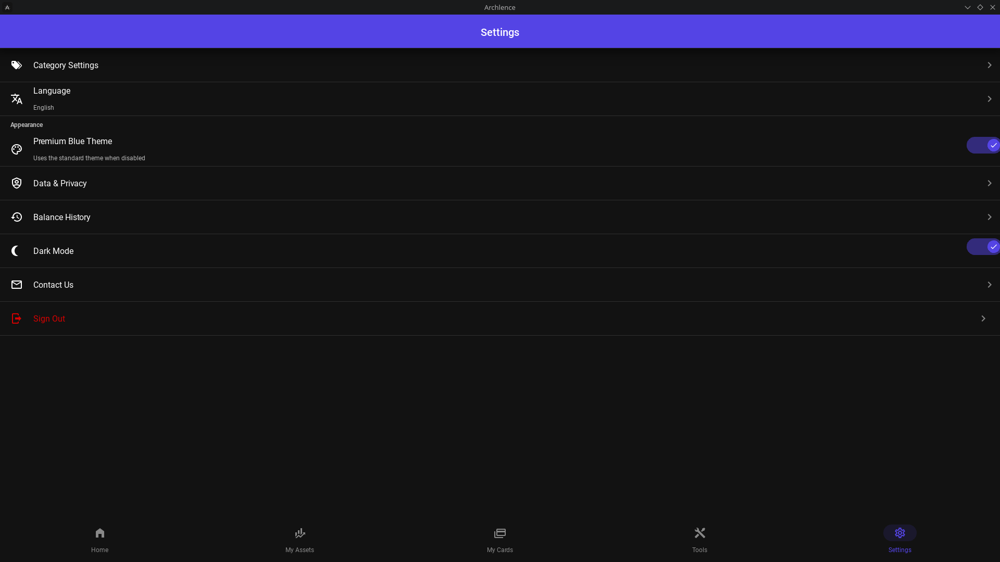

# Archlence

<p align="center">
  <strong>A local-first personal finance, cash-flow, and portfolio dashboard.</strong>
</p>

<p align="center">
  Track accounts, transactions, subscriptions, debts, credit cards, and investments from a privacy-focused desktop application.
</p>

<p align="center">
  
  
  
  
  
  
  
</p>



> All screenshots use generated sample data. No real financial information is included.

## About Archlence

Personal finance data should remain useful without becoming somebody else's dataset.

Archlence is an independently maintained, local-first desktop application for personal finance, cash-flow analysis, recurring payments, debt tracking, credit cards, and portfolio monitoring.

The repository is public to support transparent development, technical review, and future community contributions. Archlence is still under active development and should not yet be considered production-ready financial infrastructure.

## Why Archlence?

- **One financial overview:** balances, income, expenses, debts, subscriptions, cards, and investments in one interface.
- **Local-first storage:** core financial records are stored in a local SQLite database.
- **Actionable insights:** financial health scoring, cash-flow projections, and unusual-spending detection.
- **Automated routines:** recurring-payment tracking, subscription detection, and scheduled deductions.
- **Portfolio awareness:** stocks, cryptocurrencies, precious metals, and foreign currencies with background price refreshes.
- **Desktop-focused experience:** Turkish and English interface options with dark and light modes.
- **Open development:** technical debt, security work, and incomplete areas are documented rather than hidden.

## Application overview

### Dashboard and financial health

The dashboard combines current balance, period comparisons, algorithmic projections, a financial health score, active subscriptions, upcoming obligations, and recent activity.


### Portfolio overview

Review income, expenses, allocation, balance trends, and active positions from a unified portfolio workspace.



Price refreshes run outside the main UI path and use asset-aware caching to keep navigation responsive while avoiding unnecessary requests.

### Asset history

Track historical buy and sell activity, review transaction-level outcomes, and preserve the timeline behind portfolio decisions.



### Accounts and credit cards

Archlence supports cash and checking accounts as well as credit cards.

Card views expose available limits, current debt, statement access, payment actions, and local card controls.



### Subscriptions and recurring-payment detection

Review active subscriptions, upcoming renewal dates, monthly costs, and recurring-payment candidates detected from transaction history.



### Insights, debts, and upcoming payments

Archlence highlights unusual spending, tracks active debts and installment progress, and keeps upcoming automatic payments visible from the same workflow.



### Financial planning tools

The tools workspace includes monthly budgets, a calendar, general and compound-interest calculators, loan planning, savings goals, what-if scenarios, and local data operations.



### Personalization and privacy controls

Choose Turkish or English, switch between light and dark appearances, manage categories, review balance history, and access local privacy controls.



## Core capabilities

| Area | Capabilities |
| --- | --- |
| Dashboard | Period summaries, balance trends, projections, health score, subscriptions, debts, and recent activity |
| Transactions | Income and expense entry, categories, dates, pending items, recurring entries, and installments |
| Subscriptions | Detection radar, recurring schedules, automatic deductions, updates, and cancellation |
| Budgeting | Monthly plans, category allocations, recurring-payment reservations, and trend review |
| Accounts | Cash and checking accounts, balances, and account-based transaction tracking |
| Credit cards | Limits, current debt, statements, payment actions, and local card controls |
| Investments | Multi-asset portfolio, price refreshes, profit/loss calculations, and asset history |
| Debt and savings | Debt progress, installment tracking, upcoming payments, and savings goals |
| Data portability | CSV import and export for supported financial records |
| Experience | Turkish and English localization, dark and light modes, and desktop-oriented navigation |

## Architecture

Archlence separates interface, application workflows, business rules, and persistence concerns:

```text
main.py
├── ui/          Kivy layouts, reusable components, charts, themes, and i18n
├── mixins/      Application workflows and screen behavior
├── services/    Transactions, accounts, cards, pricing, insights, and projections
├── database/    SQLite schema, migrations, and ledger primitives
├── security/    Local access-control and security services
├── utils/       Formatting, currency, cryptography, and ticker helpers
└── tests/       Unit, integration, and GUI-oriented regression tests
```

Notable implementation details include:

- atomic balance updates and ledger events;
- `SAVEPOINT`-backed settlement for due transactions;
- SQLite migration guards for existing installations;
- asynchronous asset-price workers with dynamic cache lifetimes;
- local field-level protection for selected sensitive values;
- daily balance snapshots and event replay for historical balances.

## Project status

Archlence is an early-stage open-source desktop application under active development.

The current focus is:

- strengthening local encryption and key management;
- stabilizing credit-card and recurring-payment workflows;
- expanding automated and regression test coverage;
- improving packaging and installation;
- documenting architectural decisions;
- making the project easier for outside contributors to understand and extend.

Some workflows, interface elements, sample-data states, and security components are still being refined.

Archlence should not yet be treated as production financial infrastructure.

## Known limitations

The following areas are actively being improved:

- the local encryption and key-management model;
- installation and release packaging;
- consistency of sample-data presentation;
- selected credit-card and recurring-payment flows;
- some loading, localization, and UI edge cases;
- broader contributor and architecture documentation.

Known limitations are tracked openly so that progress can be reviewed over time.

## Getting started

### Requirements

- Python 3.11 or newer
- A desktop environment supported by Kivy
- Git

### Installation

Clone the repository:

```bash
git clone https://github.com/superuser-d0/archlence.git
cd archlence
```

Create a virtual environment:

```bash
python -m venv .venv
```

Activate it on Linux or macOS:

```bash
source .venv/bin/activate
```

Activate it on Windows PowerShell:

```powershell
.venv\Scripts\Activate.ps1
```

Install dependencies and start the application:

```bash
python -m pip install --upgrade pip
pip install -r requirements-runtime.txt
python main.py
```

`requirements-runtime.txt` is everything the app itself needs — nothing more.
If you also want to run lint locally (`flake8`), install
`requirements-dev.txt` too, or use the `requirements.txt` umbrella, which
installs both:

```bash
pip install -r requirements.txt
```

On first launch, Archlence guides you through creating a local PIN and setting up your first account.

## Tests

The repository includes automated coverage for the ledger, transactions, accounts, subscriptions, pricing, budgeting, history, projections, security, and UI contracts.

Run the complete test suite with:

```bash
python -m unittest discover -s tests -p "test_*.py"
```

or the equivalent convenience wrapper (same discovery, verbose output, and
a correct non-zero exit code on failure — this is what CI runs):

```bash
python run_tests.py
```

GUI checks may require a virtual display on headless Linux:

```bash
xvfb-run -a python -m unittest tests.test_gui tests.test_ids
```

## Privacy and data

Archlence is designed around local data ownership:

- core financial records are stored locally in `finance.db`, in a
  per-OS user-data directory resolved via [`platformdirs`](https://github.com/tox-dev/platformdirs)
  (`utils/app_paths.py`) — not inside the application's own install
  folder, which is commonly read-only once packaged (e.g. under `Program
  Files` on Windows). On Linux this is `~/.local/share/Archlence/`
  (config JSON lives alongside it); cached, re-fetchable data (brand
  icons) goes to `~/.cache/Archlence/`; `crash.log` goes to
  `~/.local/state/Archlence/log/`. Windows and macOS use the
  corresponding OS-standard locations for each. Upgrading from an older
  version that stored these next to the application migrates them
  automatically on first launch;
- settings, local databases, and runtime data are excluded from Git by default;
- the application does not include analytics or advertising trackers;
- CSV export provides a human-readable way to move supported records elsewhere;
- portfolio price refreshes and some visual metadata features may contact external public data sources;
- core financial records remain local and are not intentionally uploaded by those features.

Keep regular backups of your local database.

Archlence is a personal finance management tool. It is not a bank, brokerage service, accounting platform, or source of financial advice.

## Roadmap

- Stronger local encryption and installation-specific key management
- Improved credit-card reliability and statement workflows
- More consistent recurring-payment detection and presentation
- Natural-language queries over local financial history
- Local receipt parsing and categorization
- More explainable forecasts and budget recommendations
- Additional portfolio data sources and reporting options
- Improved packaging and automated release workflows
- Contributor documentation and architecture decision records

## Contributing

Issues and pull requests are welcome.

The project is still evolving, so opening an issue before a large change is recommended.

For changes to financial logic, include tests that demonstrate balance, ledger, and transaction integrity before and after the operation.

For UI changes, screenshots or short screen recordings are helpful whenever possible.

Useful contribution areas currently include:

- security and key management;
- test coverage;
- packaging and release automation;
- localization;
- accessibility;
- documentation;
- UI edge cases and regression fixes.

## Security

Please do not publish sensitive personal or financial information in issues, screenshots, test fixtures, or pull requests.

For security-related findings, use a private GitHub security advisory when possible instead of creating a public issue.

## License

Archlence is licensed under the [MIT License](LICENSE).
